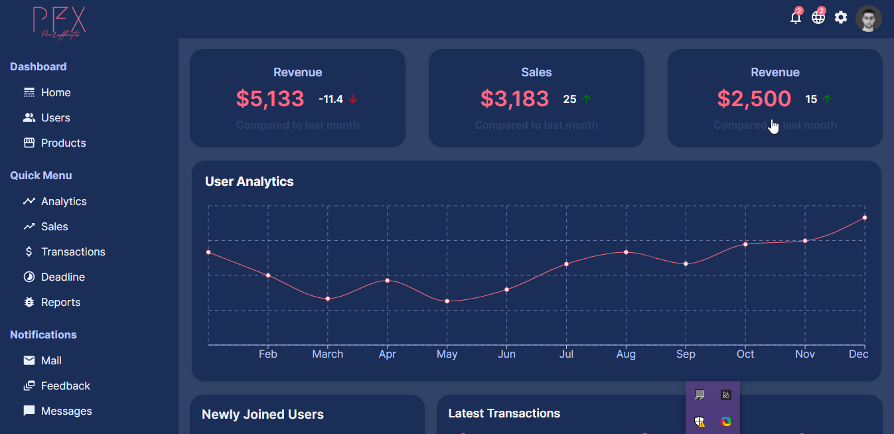

# Poor-Dashboard

### Description
Admin panel MVP with basic functionalities and slick UI in React, MUI, and Recharts

### Note: 
The server side is till a work in progress; I am currently working on implementing users authentication and scallability.

### Instructions to get it up and running: 
Clone the repo on your local machine, and then you can cd in the client directory where you can find a README for the client side of the application.
Furthermore, this project welcomes contributions of any sort. So, feel free to reach out for collaboration, raise issues and or submit pull requests.  
